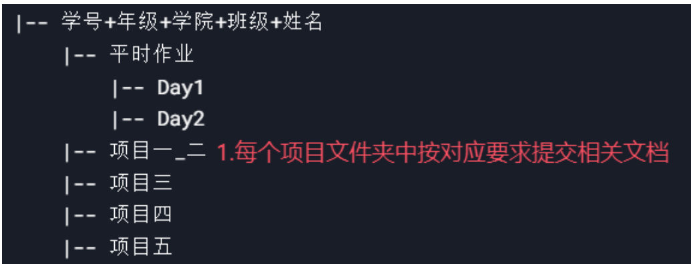
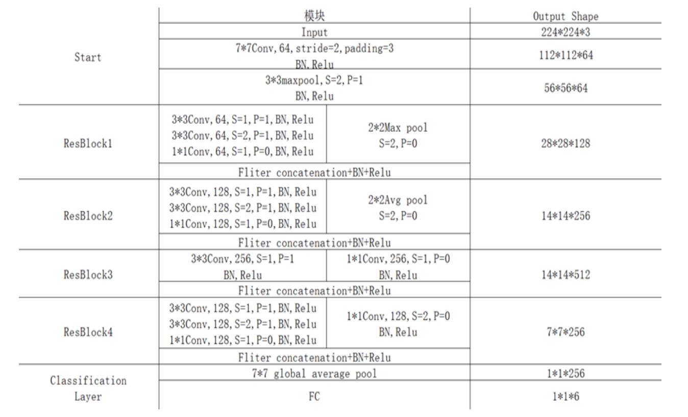
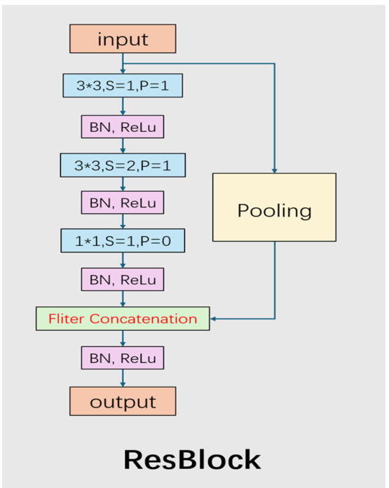
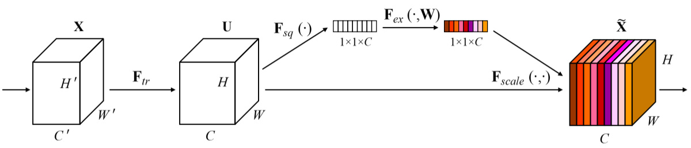
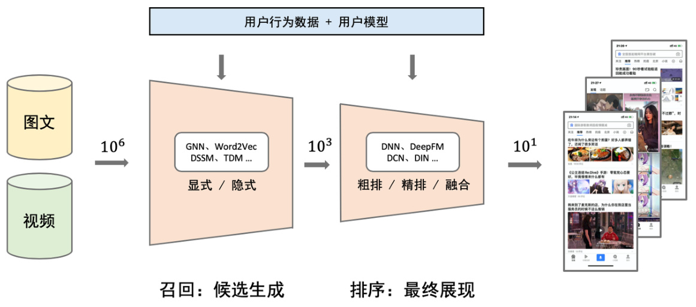
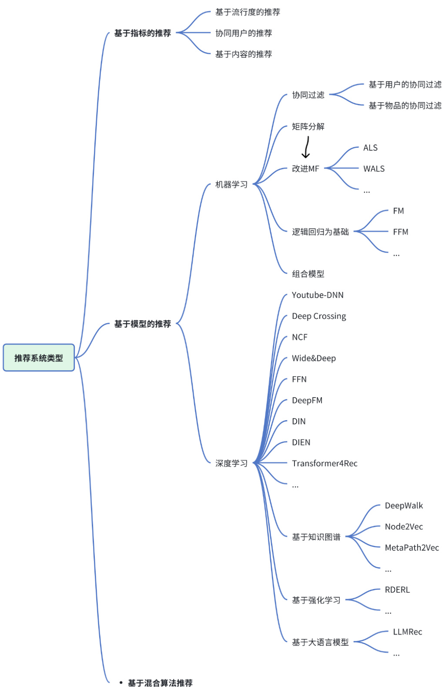
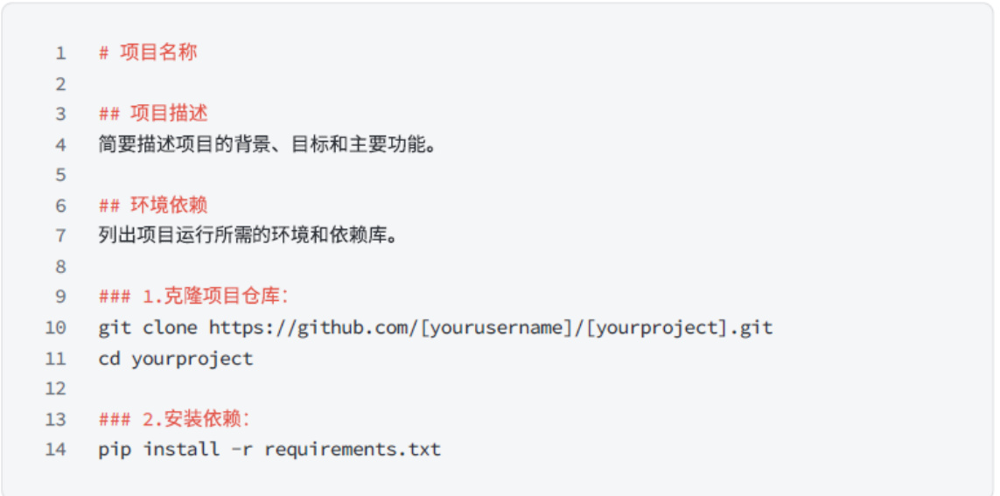

# 大数据应用实验室2025年招新考核（最终轮）

各位2023/2024级的朋友们：

首先，预祝大家新春快乐！很高兴与大家在前几轮的考核和寒假培训中相遇，一路走来，大家虽然辛苦但也有一定的收获。也许大家在前面的考核或培训中有些许不懂的地方，或是错过了前几轮考核，但是请大家放心，不会有很大的影响。最关键的、占比最大的是本次最终考核！所以希望大家继续加油，坚持就是胜利！

# 一、考核说明

本次考核包含2个基础项目（项目一、项目二）和3个附加项目。参加考核的同学需要在2025年2月20日0点之前，将所有文件按如下方式打包，并以"学号+年级+学院+班级+姓名"的方式命名（例如：202405555+信息工程学院+计算机202401+王美丽，一定要带+号），提交至课程学习平台。

完成全部基础项目即可参与开学后的答辩。根据以往经验，完成项目一、二且对大部分运行细节、基础知识熟悉，就有60%的概率被录取。

附加项目完成的越多越好，每一个附加项目中的题目要求完成越多越好。大家完成项目的过程也是学习的过程，即使没做出来，但能呈现你有所思考、对该方向有所学习，都能提升你的被录取机率。

开学后的答辩，对于只完成基础项目的同学采用3+2的形式，每多完成一个附加项目则多加2分钟答辩时长。答辩时间为开学的第一或第二个周六、周日（具体时间待定）。答辩PPT应包含：项目一如何实现的+结果指标+相关思考，项目二如何改进的+结果指标+相关思考...

课程学习平台访问方式：通过校园VPN（WebVPN资源访问控制系统登录页面）访问川农内网，再访问10.2.132.70。若没有加入课程平台班级的同学，请私聊群主，发送学号！

为了方便大家提问，减少共性问题重复提问，提高效率，我们在Gitee中创建了一个仓库，大家可以在该仓库中的issue中提问。用法见官方文档。

# 二、考核内容

## （一）基础项目一

我们提供的数据集（见基础项目一、二中）有1000余张图片，共6类。原始数据存在图片大小与模型输入不同等问题，请先对数据做好预处理，再根据我们给出的模型构建并训练一个图像分类模型。

ResBlock的搭建可参考下图：

以下是训练相关要求(Batch size等参数可视硬件条件自行修改)：

| Learning rate | 0.001 |
|--------------|-------|
| Batch size | 32 |
| Epoch | 100 |
| Train : Val : Test | 7:2:1 |
| Loss function | Cross entropy loss |
| Optimizer | SGD |

任务要求：

1. 将每个epoch的loss与acc记录并可视化，并对loss图像做出分析，写入说明文档1。

2. 使用log文件记录训练过程。

3. 提交：源码、模型权重、训练日志及说明文档1。

## （二）基础项目二

对模型进行改进，可以在项目一模型的基础上进行，也可以自行使用其他模型。

要求：

1. 尝试使用模型正则化层、dropout层等

2. 进行适当的超参数调整（优化器参数，batch_size, epoch)

3. 缝合模块。当学术裁缝是必经的过程，先学会爬才能走。这里推荐一种模块：Squeeze-and-Excitation 具体可以上网自行了解。

Figure 1: A Squeeze-and-Excitation block.

可以从模块插入的位置,数量等等出发考虑,比较效果。同时也建议大家尝试其他模块，比较各个模块的差异。

请一定在说明文档2中体现你的改进点，并附上精确度。

除了上述要求以外的一些建议：

1. 数据预处理，模型性能的好坏很大一部分程度取决于数据集的优劣，因此对数据进行合理的预处理是非常有必要的。

2. 使用学习率调度器

3. Early Stopping

4. 尝试使用不同的损失函数, 损失函数本质上就是计算预测值和真实值的差距的函数,不同的损失函数训练出的模型性能也会不同。

5. 可以尝试任何你认为合理的其他方面

最终提交：源码、权重、log日志、说明文档2。

PS：

1. 尽量将模型的每一个block单独列出，利于模型的编程与debug。

2. 模型搭建时不能直接调库 如果Early Stopping太难复现可以直接调用。

3. 优化模型有很多思路，不妨大胆尝试。

4. 只要有任何改进都可以写进说明文档。谨记最终的目标是提高准确率。

5. 不要直接用AI大模型来写代码，面试时会考察代码能力！！！

6. 硬件条件受限的同学，可以尝试使用AutoDL、Colab、Kaggle等云计算平台。在自己电脑上Debug跑通后，再在云平台上跑。

## （三）附加项目一

### 背景导言：

在现代交通管理和基础设施维护中，道路坑洞检测成为一个关键的研究领域。坑洞的存在不仅影响行车安全，还可能导致交通事故的发生和车辆损耗。通过计算机视觉技术，尤其是语义分割模型的应用，可以实现道路坑洞的精准识别和分割，为道路质量检测与维护提供强有力的技术支持。

然而，道路坑洞的检测存在诸多挑战，例如坑洞的形状和尺寸多变、与周围背景的对比度低、复杂的光照条件等。这些问题增加了检测的难度。因此，如何利用深度学习技术对道路图像中的坑洞进行精准分割，是目前的研究重点。

### 题目：

基于深度学习的道路坑洞语义分割：使用语义分割模型以及提供的道路坑洞数据集（见附加项目一文件夹），完成对像素级别坑洞区域与非坑洞区域的分割任务。

该数据集为coco-segment格式，请你尝试读取该格式的数据集并训练网络模型，可以类比项目一二，并且思考在整个流程上有哪些不同的地方（不用写出来）。

### 任务要求：

请你实现和设计至少一个基于深度学习的语义分割模型，利用该数据集，实现对道路坑洞区域的识别。如果学有余力，可以尝试探索和比较不同的深度学习模型，如UNet、SegNet和DeepLab在此任务上的表现，以期能够提供对道路图像中的坑洞空间分布的精确理解。

加分点：
1. 更改模型结构（如替换模块、调整loss函数）或应用数据增强、迁移学习等技术，提交优化前后性能对比分析，体现改进点。
2. 尝试更多分割模型（检测模型）并分析其优劣。

### 重点注意：

该数据集里面包含矩形框和像素级分割标签，所以可以选择进行，三种任务分别是：语义分割、目标检测、实例分割。难度是递增的，大家可以学习后，自己选一个来做即可，题干的描述为语义分割，但是依然可以选择后面两者，难度会更高些。

### 提交要求：

提交完整代码以及训练日志，对训练指标进行评估（eg 目标检测的AP,MAP,语义分割PA，MPA等）,需要一个简易的说明文档并且代码需要有适当的注释; 提交可视化结果，展示测试集图片，包括原图、真实Mask和模型分割结果的对比图。

### 提示：

UNet论文：https://arxiv.org/abs/1505.04597
DeepLabV3论文：https://arxiv.org/abs/1706.05587
【44 物体检测算法：R-CNN，SSD，YOLO【动手学深度学习v2】】
【46 语义分割和数据集【动手学深度学习v2】】
【使用Pytorch搭建U-Net网络并基于DRIVE数据集训练(语义分割)】

## （四）附加项目二

### 题目：

柴油NIR特征波段提取及回归。附加项目二文件夹中，diesel_prop.csv文件里面是编号对应的标签值，第一列为编号。diesel_spec.csv文件里面是柴油NIR提取的结果，第一行是波段，第一列是编号，表格中的数值是每个样本对应的反射率。

### 任务要求：

对每个指标(譬如BP50，CN等等)分别特征提取之后再做回归。1.给出每个指标的特征提取波段示意图；2.以三线表的格式把RMSE,RPD,R2展示出来，模型随意，最好有自己的思考。3.每个指标至少做1个回归分析，要求画图。（考虑到指标数目，只要求画出每个指标的特征提取波段示意图及对应的最好的结果展示，回归分析也是。）

加分点（选做）：把所有指标合并成一个综合指标DPCC(diesel physical and chemical coefficient)。提供两种思路：一是从标签本身出发，但不要单纯的加和，即便是把每个指标加上权重也要说出原因，给出定量的方案。二是从NIR提取的结果（波段，反射率）这个数据出发得到一个最能体现DPCC的值（但是注意，柴油的理化性质远不止这几个，不能直接对一行降维，这没有特殊性）。

### 提交要求：

上传一个word文档和源码，图片要求单独保存到一个文件夹，注意排版和展示的效果。

### 提示：

阅读论文: https://doi.org/10.3390/plants13091270，该论文是一个用高光谱和荧光谱提取水稻得到的任务，但本质差不多也是波段。需要读懂什么是特征提取，为什么要特征提取，为什么要二次特征提取，这个任务的本质是什么（分类？回归？聚类？）。

## （五）附加项目三（二选一）

### A.论文阅读及汇报

本题是为了选拔有潜力的科研人才，因此会被实验室大二、大三认真提问。但完成基础项目+任一其他附加项目+本项目，会有90%的录取概率。选择下列论文中的3-5篇进行阅读，并做一个单独的汇报PPT（白底黑字即可，不用交课程平台），在最终考核截止时间之前私聊群主。

1. Attention Is All You Need
2. AN IMAGE IS WORTH 16 X 16 WORDS: TRANSFORMERS FOR IMAGE RECOGNITION AT SCALE
3. Zero-Shot Object Detection: Learning to Simultaneously Recognize and Localize Novel Concepts
4. Few-Shot Object Detection with Fully Cross-Transformer
5. Learning Transferable Visual Models From Natural Language Supervision
6. ViLT: Vision-and-Language Transformer Without Convolution or Region Supervision
7. BERT: Pre-training of Deep Bidirectional Transformers for Language Understanding
8. Improving Language Understanding by Generative Pre-Training

（PS.阅读论文可以使用：小绿鲸、Zotero等）

### B.推荐系统实践

#### 背景导言：

推荐系统是一种基于用户行为和偏好，自动向用户推荐可能感兴趣的物品（如商品、电影、音乐等）的技术。它们在现代互联网应用中扮演着至关重要的角色，为用户提供个性化的体验，同时也帮助平台提升用户粘性和销售额。预计未来将朝着联邦学习、自适应推荐、可解释性推荐、社会化推荐、数据效率提升和多模态推荐等方向发展，以提升性能、增强用户体验和信任度、提高数据处理效率并丰富推荐内容。

召回：在推荐系统中，召回是指从庞大的物品库中筛选出一小部分可能符合用户兴趣的候选物品集合的过程，其目标是尽可能多地覆盖用户可能感兴趣的物品，以确保不会遗漏潜在的优质推荐选项。

排序：排序则是在召回的基础上，对候选物品集合按照用户可能的喜爱程度进行优先级排序，通过评估用户对各个候选物品的偏好概率，将最有可能被用户喜欢的物品排在前面，从而为用户提供更精准、更具吸引力的推荐列表。

面对问题：
（1）数据稀疏性：用户与物品之间的交互数据通常非常稀疏，绝大多数用户只与少数物品有过交互，导致推荐系统难以准确建模用户偏好。
（2）冷启动问题：新用户或新物品缺乏足够的历史交互数据，使得推荐系统无法有效地为其提供推荐。
（3）长尾问题:大部分冷门的商品得不到暴露,然而它们的加和价值超过热门物品。

#### 目标：

- 构建一个基础的推荐系统，能够预测用户的兴趣并提供个性化推荐。
- 不要求完整实现一个完整的推荐系统，但需要实现推荐系统中排序的一部分并了解推荐系统的运行原理。

#### 可参考资源：

1. 数据集：推荐系统通常需要大量的训练数据。为了方便起手，建议使用ml-latest.zip数据集（这是MovieLens数据集的最新版本，包含用户对电影的评分数据）。如果有余力，大家也可以选择其他感兴趣的数据集进行训练和测试。MovieLens数据集、Netflix Prize data、MicroLens数据集、Goodreads Book Graph Datasets、Anime Recommendations Database、GitHub - kang205/SASRec：Recommender Systems and Personalization Datasets、NineRec数据集。

2. 模型选择：可以选择实现以下几种推荐系统的排序模型，当然也可以自行尝试其他推荐系统模型。

- Wide&Deep：是一种结合了线性模型（Wide）的记忆能力和深度神经网络（Deep）的泛化能力的推荐系统模型，能够同时处理稀疏特征组合和复杂特征交互，提升推荐效果。

- DeepFM：DeepFM是一种结合了因子分解机（FM）和深度学习技术的推荐系统算法，利用深度学习的非线性表示能力与FM的线性表示能力，同时捕捉低阶和高阶特征交互。

- Deep_Crossing：Deep Crossing是一种深度学习架构，用于解决推荐系统中的特征交叉问题。它通过结合深度神经网络和交叉网络来自动学习特征之间的交叉关系，而无需人工特征工程。

- GBDT+LR：GBDT（Gradient Boosting Decision Trees）和LR（Logistic Regression）的结合是一种经典的集成学习方法。GBDT通过决策树的级联训练自动发现特征交互关系，生成的叶子节点作为新特征输入到LR中，进一步提升分类性能。

- DIN: DIN是一种针对电商领域点击率预估的推荐模型，利用注意力机制捕捉用户历史行为与候选广告之间的相关性，动态调整用户行为特征的权重，从而更精准地预测用户的点击行为。

- DCN:是一种结合了交叉网络和深度神经网络的推荐系统模型，通过显式学习特征交叉和捕捉复杂特征交互，自动挖掘高阶特征关系，从而提高点击率预测的准确性和效率。

3. 项目资源：由于网络问题，相关的参考项目代码托管在Gitee上,大家可以使用下方的git clone命令或者直接点击链接在项目中下载对应的zip文件。

git clone https://gitee.com/tanke11223344/Recommender-System-Evaluation.git

#### 任务要求：

1. 实现模型：从开源代码库中选择一个或多个推荐系统模型进行实现。重点关注推荐系统中的排序部分，即如何根据用户特征和物品特征预测用户的兴趣。

2. 改进模型（选做）：如果有能力，可以尝试对模型进行改进，例如：调整模型结构、添加新的特征、优化训练过程等。改进的目的是提高模型的推荐效果（如准确率、召回率等）。

模型测试标准（任选其一）：

#### 提交要求：

1. 源代码：需有清晰的注释，包括数据预处理、模型训练和测试的脚本。如果使用了特殊库或框架，需包含一个requirements.txt文件，列明所有依赖。确保代码具备可重复性，以便评审人员可以运行并验证结果。

2. README.md文档：详细说明如何运行代码，以及任何必要的安装步骤。包括模型架构的描述、训练过程和选择这些方法的理由。描述数据预处理的步骤和参数调优的过程。示例：

3. 模型文件：训练好的模型文件。如果文件过大，可提供下载链接（Google Drive\阿里云盘\百度网盘）。

4. 评估报告：提交所实现模型在评估指标上的表现，如实现了多个模型请进行比较。

#### 学习资源：

1. 代码：
https://github.com/recommenders-team/recommenders
https://github.com/hwwang55/DKN
https://github.com/PaddlePaddle/PaddleRec

2. 介绍：
https://www.bilibili.com/video/BV1EE421G7dg/?spm_id_from=333.337.search-card.all.click&vd_source=ced5a6d5721fd19bf99bfaff1eb49a03
https://www.zhihu.com/tardis/bd/art/433086709
https://zhuanlan.zhihu.com/p/433135805
https://zhuanlan.zhihu.com/p/100898327
https://www.zhihu.com/tardis/bd/art/641176648

3. 教程：
https://aistudio.baidu.com/bj-cpu-01/user/16096606/8770178/notebooks/8770178.ipynb
https://aistudio.baidu.com/projectdetail/3240640